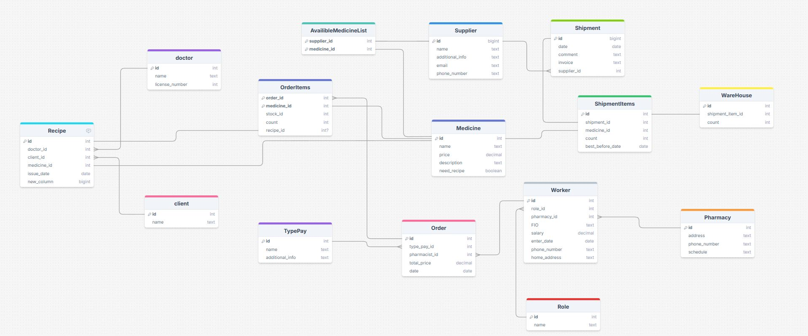
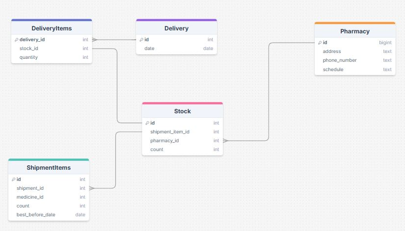

# Pharmacy Information System

Информационная система для управления сетью аптек, разработанная в рамках учебной практики ПетрГУ.

## 📌 О проекте

Система состоит из:
- **Backend API** (FastAPI + SQLAlchemy)
- **Desktop приложение** (Customtkinter)
- **База данных** (MySQL)

## 🚀 Реализованная функциональность

### 🗃️ Модели и сервисы базы данных

В проекте реализованы следующие сущности с соответствующими сервисами для работы с БД:

| Категория         | Сущности (таблицы)                                                       |
|-------------------|--------------------------------------------------------------------------|
| Лекарства         | `Medicine`, `AvailableMedicineList`                                      |
| Персонал          | `Worker`, `Role`                                                         |
| Склады            | `Warehouse`, `Shipment`, `ShipmentItems`                                 |
| Заказы            | `Order`                                                                  |
| Аптеки            | `Pharmacy`                                                               |
| Поставщики        | `Supplier`                                                               |
| Рецепты           | `Recipe`, `Client`, `Doctor`                                             |


### 🌐 API Endpoints

Реализованы следующие группы API эндпоинтов:

#### 💊 Лекарства (/medicine)
#### 🏥 Заказы и рецепты (/order)
#### 👥 Персонал и роли (/worker)
#### 🏭 Поставщики и поставки (/shipment)
#### 🏪 Аптеки (/pharmacy)


## 🗄️ Проектирование БД

### Схема базы данных




Основные сущности:
- **Сотрудники** (Worker) - сотрудники сети аптек;
- **Лекарства** (Medicine) - информация о лекрствах (товарах);
- **Рецепты** (Recipe) - назначения врачей;
- **Заказы** (Order) - покупки клиентов;
- **Закупки** (Shipment) - закупки у поставщиков;
- **Аптеки** (Pharmacy) - аптеки.


## 🚀 Запуск проекта

### Необходимые компоненты
- Python 3.10+
- MySQL

### Установка
```bash
git clone https://github.com/Kabaaaan/Pharmacy_IS.git
cd Pharmacy_IS
```

### Настройка БД
1. Создайте файл `.env` в корне проекта:
```ini
DB_HOST=localhost
DB_USER=pharmacy_user
DB_PASSWORD=your_password
DB_DATABASE=pharmacy_db
```

2. Инициализируйте БД:
```mysql
create database pharmacy_db;
```
```bash
pip install src/requirements.txt
python src/api/database/init_db.py
```

### Запуск API
```bash
python src/api/main.py
```

### Запуск приложения
```bash
python src/app/main.py
```

## 👥 Разработчики
- https://github.com/Kabaaaan
- https://github.com/ulyagolova

## 📄 Лицензия
MIT License © 2025